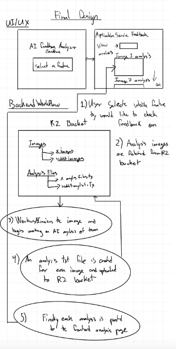
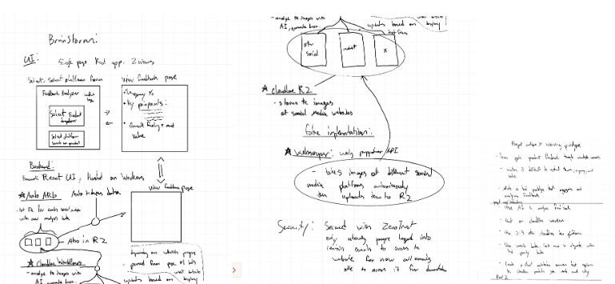

# cf_feedback_analyzer

This project is an **AI Feedback Analyzer for Cloudflare**. It gives you a simple way to run AI analysis on customer feedback that lives as images (e.g. screenshots from Reddit or X). You pick a feature area, trigger a run, and then view structured summaries—opinions, overall sentiment, and estimated satisfaction—generated from those images.

**Architecture:** The UI is a React + Vite single-page app served and deployed via a Cloudflare Worker (using the `@cloudflare/vite-plugin` and static assets). The Worker implements the backend: it reads image keys from an R2 bucket, runs each image through Cloudflare’s Workers AI vision model (LLaVA), and writes plain-text analysis files back into the same R2 bucket. The frontend calls `POST /api/trigger-analysis` to start a run and `GET /api/analysis` to list and display the generated analyses. So the stack is: SPA → Worker (API + asset routing) → R2 (images + analysis outputs) and Workers AI (LLaVA).

**Vision:** What’s built today is a prototype. The longer-term goal is to add a web scraper that autonomously pulls feedback images from each social media site (e.g. Reddit, X), uploads them into the R2 bucket, and then automatically triggers Workers AI to analyze them and refresh the analysis page for each product. More products will be added to the dropdown over time so the analyzer can cover multiple Cloudflare offerings.

---

## Screenshots

